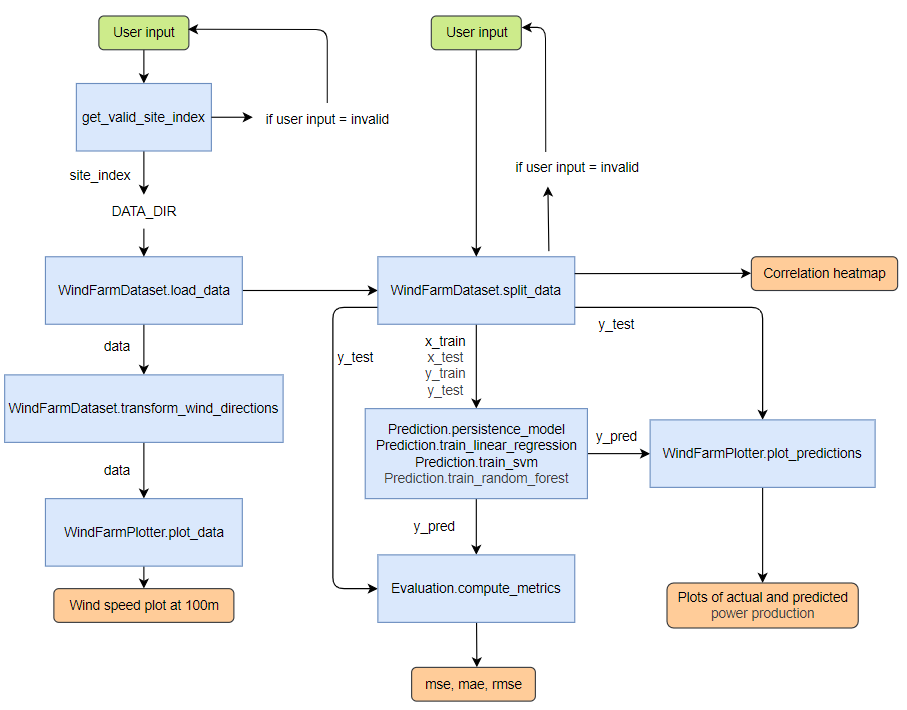

# Our Great Package - Wind Power Forecasting

Team: Git_Happens

## Overview

This project aims to develop a prediction-system for wind power generation. The objective is to forecast wind power output using meteorological data from 4 different locations. By applying different machine learning models, the system aims to accurately forecast using different forecasting horizons (1 or 24 hours). This project supports:
- User interaction to select site location and forecasting horizon
- Preprocessing and transformation of wind data
- Utilizing different lag features and correlation analysis
- Training and evaluation of four prediction models (persistence, linear regression, support vector machine, and random forecast)
- Plotting wind speed, and actual and predicted power production.

## Directory structure

The directory structure can be seen below:

```bash
final-project-git_happens/
│
├── examples/
│   └── main.py                     # main script
├── figures/                        # code-diagram
├── inputs/                         # input .csv-files (Location 1, 2, 3 and 4)   
├── outputs/                        # generated plots and heatmaps
├── src/final_project_git_happens
│   └── __init__.py                 # contains classes
├── tests/
│   └── test_final_project          # contains tests
├── environment.yml                 # environment dependencies
├── pyproject.toml                  # package
└── README.md                       # project overview and instructions
```

## Quick-start guide

### 1. Set up the environment

Install the conda environment used for this project by following the steps below:

1. Open your terminal and navigate the the repository folder
```bash
cd path/to/your/repo
```
2. Create the environment by running the following command:
```bash
conda env create -f environment.yml
```
3. Activate the environment.
```bash
conda activate GitHappens_FinalProject
```
Alternatively, if you want to install the packages in your own environment, you can do so by running the following command for each package in your terminal:

```bash
pip install <package_name>
```

Here are the packages to install:
* python 3.11
* pandas
* numpy
* matplotlib
* scikit-learn
* seaborn
* pylint
* pytest
* pytest-cov
* -e .

### 2. Execute main.py
1. Run main.py located in final-project-git_happens/examples.
2. Firstly, The user will be prompted to input site index in the terminal.
3. Later, the user will be prompted to input the desired forecasting horizon in the terminal.
4. MSE, MAE and RMSE for each model is printed to terminal.
5. All plots can be found in final-project-git_happens/outputs.

## Architecture

The project consists of four main components, each described in its own class in final-project-git_happens/src/final_project_git_happens/__init__.py. 

The main.py file calls the functions as seen in the diagram below. The main script includes the following interactions: User input for site and forecasting horizon; data loading, transformation and plotting; model training, prediction and evaluation; printing results and saving plots.



## Class descriptions
This project defines classes and functions used for wind power forecasting using machine learning. It is designed to handle loading and preprocessing of data, visualization, prediction and evaluation of the models. All classes are located in final-project-git_happens/src/final_project_git_happens/__init__.py.

### WindFarmDataset
Purpose: This class handles data loading, preprocessing, and splitting of wind farm time-series data.

Features:
- Loads data from .csv-file
- Transforms wind direction angles into radians
- Creates lagged features for time-series forecasting
- Selects features based on correlation with target variable (power)
- Split data into training and testing sets.

The outputs from this class is intended to be used later by the WindFarmPlotter- and Prediction-classes.

### WindFarmPlotter
Purpose: Visualizes wind power time-series data and model predictions.

Features:
- Plots raw data over selected time intervals
- Compares predicted and actual data for different prediction models.
- Saves plots as .png

This class uses data from the Prediction-class to visualize model performance alongside raw data.

### Evaluation
Purpose: Calculates evaluation metrics for prediction models.

Features:
- Computes Mean Squared Error (MSE), Mean Absolute Error (MAE), and Root Mean Squared Error (RMSE) for the prediction models.

This class is called after model prediction to assess forecasting performance and works with any of the models from the Prediction-class.

### Prediction
Purpose: Implements prediction models used for wind power forecasting.

Features:
- Persistence model
- Linear regression
- Support Vector Machine (SVM)
- Random forest
- Each model can be used to generate predictions based on lagged input feature.

The Prediction-class uses outputs from WindFarmDataset. The outputs from the class are used for the Evaluation- and WindFarmPlotter-classes.

### Additional functions
get_valid_site_index(): Prompts the user to input a valid site location index (1,2,3 or 4). Input is validated.

get_lag_hours(): Prompts the user to input a forecasting horizon (1 or 24 hours). The input is validated.

## Git collaboration
Our team followed a structured Git workflow as described below:
- Use of feature branches
- Avoid commits directly to main
- Use of pull request. Before merging any feature branch the pull request was reviewed by another member of the team.
- Clear commit messages
- Feature branches were deleted once the branch was merged into main.

## Team contribution
The work was evenly distributed between the members of the group. All team members participated in discussions about the code and created initial pseudo-code.

Main responsibilities:
- Anna Thuesen (s214253): README-file and diagram. Create classes.
- Klara Pihl Storgaard (s204130): Functions under WindFarmPlotter-class. Tests.
- Renato Silva (s250675): Functions under WindFarmDataset-, Evaluation- and Prediction-classes

